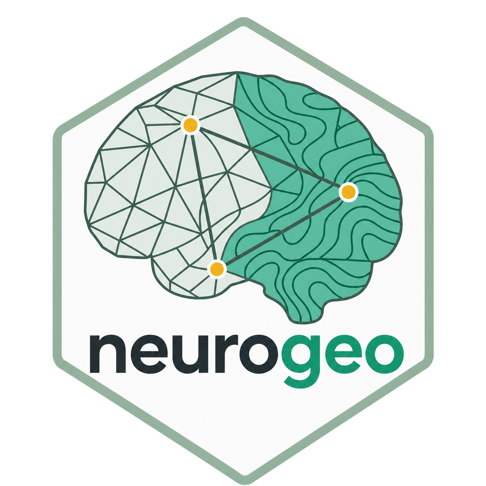

# neurogeo 

`neurogeo` is the R reference implementation of the Neuroimaging
Geoinformatics Core Specification (NGCS).

The 6.0 data model has one sentence:

> A spatial base defines where data live; layers contain the data observed on
> that base; measures describe what those values mean.

An `ngeo` object therefore contains five top-level components:

```text
ngeo
├── base
├── values
├── layers
├── measures
└── history
```

`values[i, j]` is always aligned with `spatial_base(x)$elements[i, ]` and
`layers(x)[j, ]`. Each layer refers to one row in `measures(x)` through
`measure_id`.

## Installation

```r
install.packages("remotes")
remotes::install_github("zh1peng/neurogeo")
```

## Minimal workflow

```r
library(neurogeo)

coordinates <- as.matrix(expand.grid(x = 0:2, y = 0:2))
x <- ngeo_point(
  coordinates,
  values = cbind(signal = c(1, 2, 3, 2, 4, 7, 3, 7, 9)),
  measures = ngeo_measure(
    support_behavior = "intensive",
    unit = "a.u."
  ),
  coordinate_space = ngeo_coordinate_space(
    space_id = "example-grid",
    kind = "unknown",
    unit = "mm"
  )
)

spatial_base(x)
values(x)
layers(x)
measures(x)
history(x)

w <- ngeo_spatial_weights(
  x,
  method = "distance_band",
  threshold = 1.01,
  distance_method = "euclidean",
  style = "W"
)
ngeo_moran(x, w, map = "signal", permutations = 999, seed = 2026)
```

The five spatial-base types are `point`, `surface`, `volume`, `parcellation`,
and `grayordinate`. Type-specific coordinates, meshes, voxel grids, affine
matrices, memberships, and brain-model mappings live under `base$geometry`.
`coordinate_space` is part of the base; topology is optional. Distance methods,
spatial weights, transforms, and support mappings are analysis objects rather
than mandatory dataset fields.

## Multiple layers and measures

One hundred subjects with DK68 cortical thickness are represented by a
68-by-100 values matrix, 100 layer rows, and one measure row:

```r
x <- ngeo_parcellation(
  parcels,
  values = thickness,
  layers = data.frame(
    layer_id = sprintf("subject_%03d", 1:100),
    measure_id = "cortical_thickness",
    subject = sprintf("sub-%03d", 1:100)
  ),
  measures = data.frame(
    measure_id = "cortical_thickness",
    name = "cortical thickness",
    unit = "mm",
    value_type = "continuous",
    support_behavior = "intensive",
    aggregation = "area_weighted_mean"
  )
)
```

Layer and measure metadata may be omitted for simple inputs; constructors
generate valid unknown metadata and operations validate capabilities when they
need them.

## Spatial aggregation

User-facing aggregation is `aggregate_to()`. It performs a formal change of
spatial support using a declared support map and the measure's aggregation
semantics:

```r
atlas <- ngeo_atlas_map(surface, atlas_labels)
regional <- aggregate_to(surface, atlas$target, atlas)
```

No reader or analysis silently registers, resamples, segments, or converts an
incompatible spatial base.

## Supported inputs

- NIfTI through `RNifti`;
- GIFTI geometry, metric arrays, and labels through `gifti`;
- CIFTI dscalar, dlabel, and dtseries through `cifti`;
- FreeSurfer surface, annot, curv, MGH, and MGZ through
  `freesurferformats`;
- ordinary coordinates, faces, arrays, labels, and affine matrices through
  native constructors.

FreeSurfer, FSL, and Connectome Workbench are not runtime dependencies.

## Validation

```r
ngeo_validate(x, "basic")
ngeo_validate(x, "strict")
ngeo_capabilities(x)
```

Construction enforces alignment. Operations add capability requirements only
when needed: plotting requires geometry, geodesic analysis requires surface
geometry and topology, spatial statistics require spatial weights, aggregation
requires support and measure semantics, and cross-space mapping requires a
coordinate space and transform.

See the [Chinese guide](https://zh1peng.github.io/neurogeo/guide/),
[tutorial index](https://zh1peng.github.io/neurogeo/tutorials/), and
[API reference](https://zh1peng.github.io/neurogeo/api/reference/).
